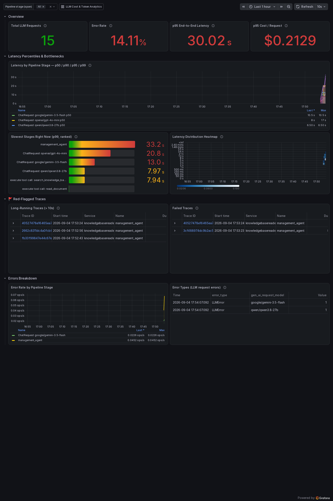
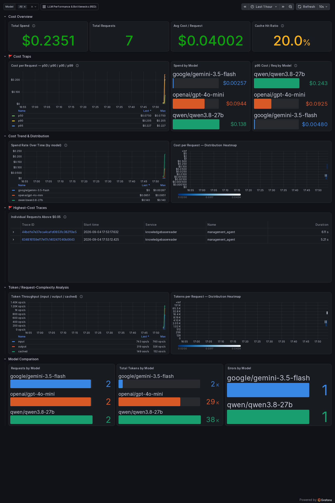
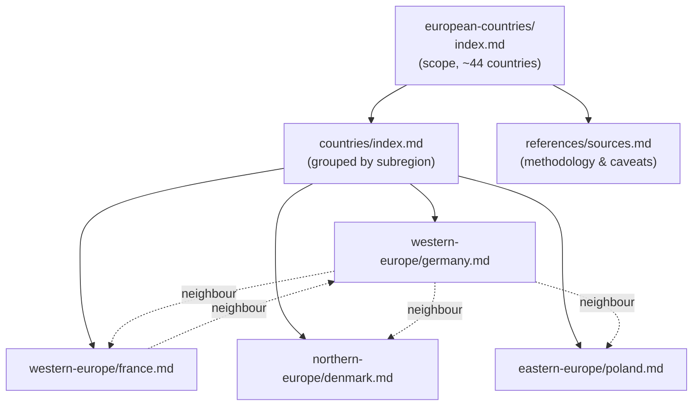
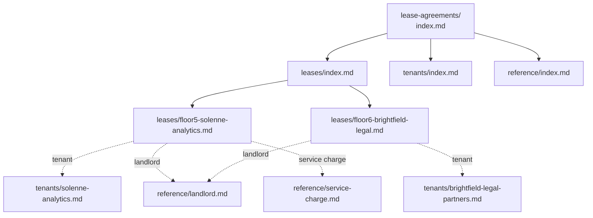

<p align="center">
  
</p>

<h1 align="center">typescript-okf</h1>

<p align="center">
  A TypeScript agent that answers questions from a local, versioned knowledge base — grounded, traceable, and cost-observable by design.
</p>

<p align="center">
  
  
  
</p>

---

## Overview

**typescript-okf** answers questions by reading a local **Open Knowledge
Format (OKF)** knowledge base — a folder of Markdown files with YAML
frontmatter — rather than relying solely on what the underlying model
learned during training.

It connects to an LLM through [OpenRouter](https://openrouter.ai/) and gives
the model one tool, `read_knowledge_base_document`, which it uses to open
Markdown documents from the knowledge base and follow links between them, the
way a person would browse a wiki, until it has enough information to answer.

## Features

- **Grounded answers** — responses are built from documents the agent
  actively chooses to read, not from parametric memory alone.
- **Agentic tool use** — a bounded tool-call loop lets the model navigate the
  knowledge base on its own, following cross-references between documents.
- **Structured output** — responses are constrained to a JSON schema
  generated from a TypeScript type, so downstream code gets a typed,
  predictable result.
- **Pluggable knowledge bases** — add a new one by dropping a folder with an
  `index.md` into `data/knowledge_bases/`; no code changes required.
- **Built-in observability** — every LLM call and tool call is traced and
  metered with OpenTelemetry, with two ready-made Grafana dashboards for
  latency, bottlenecks, cost, and token usage.

## Table of Contents

- [Getting Started](#getting-started)
- [Examples](#examples)
- [Configuration](#configuration)
- [Running](#running)
- [Building](#building)
- [Observability](#observability)
- [Architecture](#architecture)
- [Appendix: Knowledge Base Structure](#appendix-knowledge-base-structure)
- [License](#license)

## Getting Started

### Prerequisites

- [Node.js](https://nodejs.org/) (LTS) and npm
- An [OpenRouter](https://openrouter.ai/) API key

### Installation

```bash
npm install
```

Set your [OpenRouter](https://openrouter.ai/) API key (see
[Configuration](#configuration) below), then try one of the two bundled
examples — the fastest way to see the agent in action against a real
knowledge base.

## Examples

[src/examples/](src/examples/) contains two self-contained scripts, each
pointed at a different bundled knowledge base with a question tailored to
it. They're the recommended starting point — more so than the generic
[src/app.ts](src/app.ts) described under [Running](#running) — since each
one demonstrates the agent grounded in a specific, coherent knowledge base.

### 1. Facility management

[src/examples/facility_management.ts](src/examples/facility_management.ts)
points the agent at
[data/knowledge_bases/facility_management](data/knowledge_bases/facility_management),
which covers lease agreements, tenants, maintenance contracts, equipment
manuals, and office blueprints across a portfolio of buildings, and asks:

> I want to lease a floor in one of your buildings, what are the available
> options and what are the prices?

Run it with `tsx`:

```bash
npx tsx src/examples/facility_management.ts
```

Or launch **Example: Facility Management** from the VS Code Run and Debug
panel (see [.vscode/launch.json](.vscode/launch.json)).

### 2. Geographics

[src/examples/geographics.ts](src/examples/geographics.ts) points the agent
at [data/knowledge_bases/geographics](data/knowledge_bases/geographics),
which covers capitals, population, and neighbouring countries for 44
European countries, and asks:

> What is the capital of Germany and what are the capitals of the neighbor
> countries?

Run it with `tsx`:

```bash
npx tsx src/examples/geographics.ts
```

Or launch **Example: Geographics** from the VS Code Run and Debug panel.

Both scripts set the `KNOWLEDGE_DATABASES` environment variable in-process
before calling the agent, so they work out of the box without any
additional configuration — see [Configuration](#configuration) for how that
variable is resolved.

## Configuration

### 1. OpenRouter API key

The app reads the key from the `OPENROUTER_API_KEY` environment variable
(see [src/openrouter.ts](src/openrouter.ts)).

PowerShell:

```powershell
$env:OPENROUTER_API_KEY = "sk-or-..."
```

bash:

```bash
export OPENROUTER_API_KEY="sk-or-..."
```

### 2. Knowledge base location

Knowledge bases live in [data/knowledge_bases/](data/knowledge_bases/) by
default, read from the `KNOWLEDGE_DATABASES` environment variable in
[src/knowledgebases/okf.ts](src/knowledgebases/okf.ts):

```ts
const KNOWLEDGE_DATABASES = process.env.KNOWLEDGE_DATABASES ?? "data/knowledge_bases";
```

Each subfolder under this path is treated as one knowledge base and must
contain an `index.md` file (with optional YAML frontmatter) describing its
contents and how to navigate it. Add more knowledge bases by dropping
another such folder in here, or point elsewhere by setting the environment
variable:

PowerShell:

```powershell
$env:KNOWLEDGE_DATABASES = "C:\path\to\knowledge_bases"
```

bash:

```bash
export KNOWLEDGE_DATABASES="/path/to/knowledge_bases"
```

Bundled knowledge bases (see [Examples](#examples) for how to try each one):

- **`geographics/european-countries`** — capitals, population, and
  neighbouring countries for 44 European countries, organized by sub-region
  (western/northern/southern/southeastern/eastern Europe).
- **`facility_management/*`** — four knowledge bases covering a portfolio of
  office buildings: `lease-agreements`, `maintenance-contracts`,
  `equipment-manuals`, and `office-blueprints`.

## Running

For a guided first run, use the two [examples](#examples) instead — each
pairs a specific knowledge base with a matching question.

```bash
npm run start
```

This runs [src/app.ts](src/app.ts) with `tsx`, the generic entry point that
asks the agent a sample question against the default knowledge base
(`KNOWLEDGE_DATABASES`, see [Configuration](#configuration)) and prints the
answer to the console. A **Debug app.ts** launch config is also available in
[.vscode/launch.json](.vscode/launch.json).

## Building

To type-check and transpile to `dist/`:

```bash
npm run build
```

## Observability

The app exports OpenTelemetry traces and metrics for every LLM call and tool
call (see [src/observability/otel.ts](src/observability/otel.ts)), backed by
a local Grafana, Prometheus, and Tempo stack defined in
[docker-compose.yaml](docker-compose.yaml).

### Starting the stack

```bash
docker compose up -d
```

This starts four services on the `monitoring` Docker network:

| Service | URL | Purpose |
|---|---|---|
| Grafana | http://localhost:3000 | Dashboards (anonymous access, no login required) |
| Prometheus | http://localhost:9090 | Metrics storage; scrapes the collector every 10s |
| Tempo | http://localhost:3200 | Trace storage |
| OTel Collector | `localhost:4317` (gRPC) | Receives traces/metrics from the app, forwards them to Tempo and Prometheus, and derives RED metrics from spans via a `span_metrics` connector |

With the stack running, start the app (`npm run start`) and it reports
automatically — [src/observability/otel.ts](src/observability/otel.ts) points
the OTLP exporters at `localhost:4317`.

Stop everything with `docker compose down`. No volumes are configured, so
this also clears all collected metrics and traces — by design, for a clean
local dev setup. Add volume mounts to `prometheus` and `tempo` in
`docker-compose.yaml` if you need history to survive a restart.

### Dashboards

Two dashboards are provisioned automatically into an **LLM Observability**
folder in Grafana on startup (see
[config/grafana/provisioning/dashboards/](config/grafana/provisioning/dashboards/))
— no manual import required.

#### LLM Performance & Bottlenecks (RED)

Request rate, error rate, and p50/p90/p95/p99 latency for every stage of the
agent pipeline — orchestration, each LLM call, each tool call — so you can
see which stage is actually the bottleneck rather than only the end-to-end
time. Includes a ranked "slowest stage right now" view, a latency heatmap,
and two tables sourced live from Tempo that flag individual traces: ones
that ran longer than 10 seconds, and ones that failed.



#### LLM Cost & Token Analytics

Total spend, cost-per-request percentiles, cache hit ratio, and token
throughput (input/output/cached), broken down by model. Includes a
cost-per-request heatmap and a table of individual traces that crossed a
$0.05 cost-trap threshold, linking directly to the full trace in Tempo.



Both dashboards start empty on a cold `docker compose up` — every panel
shows "No data" until real traffic flows through `send_chat_request`. The
screenshots above were captured with a handful of sample requests seeded in.

## Architecture

```
src/
  app.ts                    entry point / demo query
  agents.ts                 assembles the system prompt + tools into an agent
  model.ts                  response type(s) sent to the LLM as a JSON schema
  openrouter.ts             LLM call loop (OpenRouter client, tool-call handling)
  observability/otel.ts     OpenTelemetry setup: tracing, metrics, instrumentation helpers
  prompts/system_prompt.md  system prompt describing the agent's rules
  knowledgebases/okf.ts     reads/lists OKF knowledge bases from disk
  tools/tools.ts            generic tool definition type
  tools/okf_tools.ts        tool that lets the LLM read a knowledge base document
data/
  knowledge_bases/          OKF knowledge bases (e.g. european-countries)
config/                     OpenTelemetry Collector, Prometheus, Tempo, and Grafana config
```

### How it works

1. **[src/app.ts](src/app.ts)** is the entry point. It calls
   `management_agent(...)` with a question.
2. **[src/agents.ts](src/agents.ts)** builds the agent: it loads the system
   prompt from [src/prompts/system_prompt.md](src/prompts/system_prompt.md),
   lists the available knowledge bases, and injects them into the prompt.
3. **[src/openrouter.ts](src/openrouter.ts)** (`call_llm`) drives the
   conversation with the model configured there:
   - It generates a strict JSON schema for the expected response type
     (from [src/model.ts](src/model.ts)) using `typescript-json-schema`, and
     asks the model to reply in that schema.
   - If the model requests a tool call, the requested tool
     (`read_okf_tool` in [src/tools/okf_tools.ts](src/tools/okf_tools.ts))
     is executed and its result is fed back to the model.
   - This repeats (up to `MAX_TURNS`) until the model returns a final
     answer instead of another tool call.
4. **[src/knowledgebases/okf.ts](src/knowledgebases/okf.ts)** implements
   knowledge base access:
   - `listKnowledgeBases()` scans a root folder for subfolders (each one a
     knowledge base) and reads each one's `index.md`.
   - `read_knowledge()` reads and parses a specific Markdown document
     (frontmatter + content) from a given knowledge base — what the
     `read_knowledge_base_document` tool calls under the hood.

In short: the app asks a question, hands the LLM a map of the available
knowledge bases, and lets the LLM decide which documents to open — via tool
calls — until it has enough information to answer.

## Appendix: Knowledge Base Structure

Every knowledge base under [data/knowledge_bases/](data/knowledge_bases/) follows the same
shape: a root folder with an `index.md` entry point, topic subfolders (each with its own
`index.md`), and leaf documents — Markdown files with YAML frontmatter — that link to each
other the way wiki pages do. The agent starts at the top-level index and follows these links,
one `read_knowledge_base_document` tool call at a time, until it has what it needs. The two
bundled examples below show this shape in practice.

### Geographics (`european-countries`)

A single knowledge base with one root [index.md](data/knowledge_bases/geographics/european-countries/index.md)
describing its 44-country scope. A [countries/](data/knowledge_bases/geographics/european-countries/countries/index.md)
folder groups country documents by subregion via its own index; each country document (e.g.
[germany.md](data/knowledge_bases/geographics/european-countries/countries/western-europe/germany.md))
states its capital and population and links out to its land-neighbours in other subregion
folders — the cross-links a person would click through on a wiki. A separate
[references/](data/knowledge_bases/geographics/european-countries/references/sources.md) folder
holds shared methodology notes, linked from the root index.



### Facility management (`facility_management/*`)

`facility_management` is actually four sibling knowledge bases — `lease-agreements`,
`maintenance-contracts`, `equipment-manuals`, `office-blueprints` — each self-contained: by
design they don't cross-link to one another, even where the same floors or equipment appear in
more than one. The diagram below shows the internal shape of one of them,
[lease-agreements](data/knowledge_bases/facility_management/lease-agreements/index.md): its root
index links to three category indexes (`leases/`, `tenants/`, `reference/`); each lease document
then cross-links to its tenant and to shared reference documents such as the landlord and rent
schedule. The other three knowledge bases follow the same pattern, just with different
categories.



## License

Copyright © 2026 Erik Bamberg. Distributed under the
[Apache License, Version 2.0](LICENSE).
